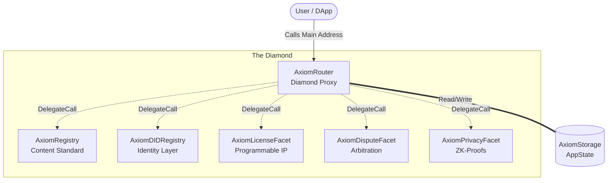

# 🛡️ AXIOM Protocol

## The Future of Digital Authenticity

**Decentralized. Verifiable. Immutable.**


> _"In an era where AI can generate infinite realities, AXIOM provides the cryptographic anchor to truth."_

---

## 🌟 Overview

**AXIOM Protocol** is a next-generation content authentication layer built for the AI age. It empowers creators, journalists, and organizations to cryptographically sign their digital content, creating an unforgeable chain of custody.

By leveraging **Zero-Knowledge Proofs (ZK)**, **Decentralized Identifiers (DIDs)**, and **Smart Licensing**, AXIOM solves the "Oracle Problem" for digital media—proving not just _when_ something was published, but _who_ published it and _how_ it can be used.

### Why AXIOM?

- **🤖 Combat Deepfakes**: Instantly verify if a video or image is authentic or AI-manipulated.
- **🎨 Protect Intellectual Property**: Automate monetization with programmable, on-chain licenses.
- **⚖️ Trustless Dispute Resolution**: A decentralized court system to settle ownership claims.
- **🔒 Privacy-First**: Prove ownership without revealing your identity or the content itself.

---

## 🏗️ Architecture: The Diamond Pattern

AXIOM is built on the robust **Diamond Pattern (EIP-2535)**, enabling a modular, upgradeable, and limitless smart contract system.



---

## ⚡ Ecosystem & Features

AXIOM is more than just a registry; it's a complete ecosystem for digital trust.

### 🆔 Decentralized Identity (DID)

**"Your Reputation, Owned by You."**

- **W3C Compliant**: Implements the official DID standard for interoperability.
- **Verification Levels**: graduated trust tiers (Email -> Social -> Government ID).
- **Sybil Resistance**: Bonded identities prevent spam and malicious actors.
- **Use Case**: A news organization can prove they published a breaking story, preventing imposters.

### 📜 Smart Licensing

**"IP that Pays You Back."**

- **Programmable Rights**: embedded logic for _Commercial_, _Non-Commercial_, or _Exclusive_ use.
- **Instant Monetization**: Purchase licenses directly on-chain with automatic royalty splits.
- **NFT Representation**: Licenses are minted as NFTs transparency and transferability.
- **Use Case**: An artist releases a song; influencers can instantly buy a "Remix License" to use it in their content.

### ⚖️ The dispute Protocol

**"Truth via Game Theory."**

- **Stake-to-Challenge**: Anyone can challenge a content claim by staking tokens.
- **Decentralized Arbitration**: Disputes are resolved by random, incentivized jurors.
- **Slash & Burn**: Malicious actors lose their stake; honest claimers are rewarded.
- **Use Case**: Use verified stock footage that was actually stolen? The original creator challenges the claim and wins the bounty.

### 🔒 Zero-Knowledge Privacy

**"Prove Without Revealing."**

- **Confidential Registration**: Register content fingerprints (hashes) without exposing the file.
- **Selective Disclosure**: Reveal ownership only to specific parties (e.g., a buyer).
- **GDPR Compliance**: "Right to be Forgotten" is baked into the protocol logic.
- **Use Case**: A whistleblower registers sensitive documents to prove existence, revealing them only when safety is guaranteed.

---

## 💻 The "Glass Citadel" Interface

The AXIOM frontend is a marvel of modern engineering, designed for security and speed.

- **Stack**: Next.js 14, Wagmi, RainbowKit.
- **Client-Side Computing**: ALL files are hashed locally in your browser using **Web Workers**. Your data _never_ leaves your device.
- **Drag-and-Drop Verification**: Drop any file to instantly check its history, creator, and license status.
- **Visual Trust**: A "Traffic Light" system (🟢 Verified, 🟡 Unverified, 🔴 Disputed) simplifies complex crypto states.

---

## � Quick Start

### Prerequisites

- [Foundry](https://book.getfoundry.sh/)
- [Node.js](https://nodejs.org/) (for frontend)

### Installation

```bash
# Clone the repository
git clone https://github.com/axiom-protocol/axiom-core.git
cd axiom-core

# Install dependencies
forge install

# Build contracts
forge build

# Run test suite
forge test
```

---

## 🗺️ Roadmap

- [x] **Phase 1: Core Foundation** (Registry, Router, Access Control)
- [x] **Phase 2: Business Logic** (Licensing Facet, Dispute Facet)
- [x] **Phase 3: Identity** (DID Registry, Verification)
- [ ] **Phase 4: Privacy** (ZK-Circuit implementation & Privacy Facet)
- [ ] **Phase 5: Glass Citadel Beta** (Public Testnet Launch)
- [ ] **Phase 6: Mainnet** (Token Generation Event)

---

## 🤝 Contributing

We are building the trust layer of the internet. If you want to help:

1. Fork the repo.
2. Create a branch (`feat/quantum-resistance`).
3. Submit a PR.

**Bounties**: ongoing bug bounties for logic errors and economic exploits.

---

## 📄 License

AXIOM Protocol is open-source software licensed under the **MIT License**.

---

<p align="center">
  <i>"Veritas in Codice" — Truth in Code</i>
</p>
